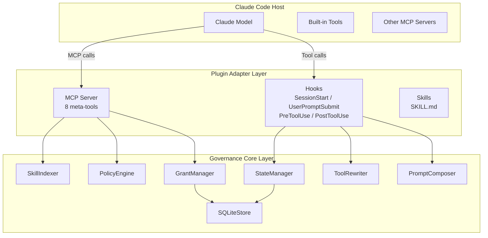
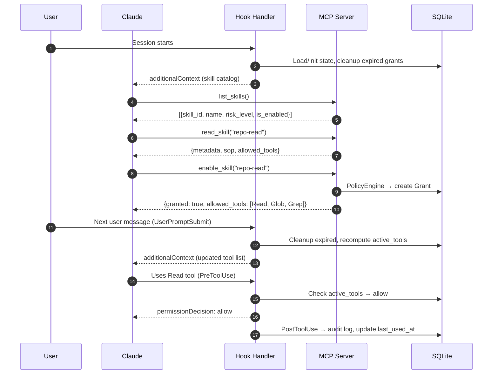
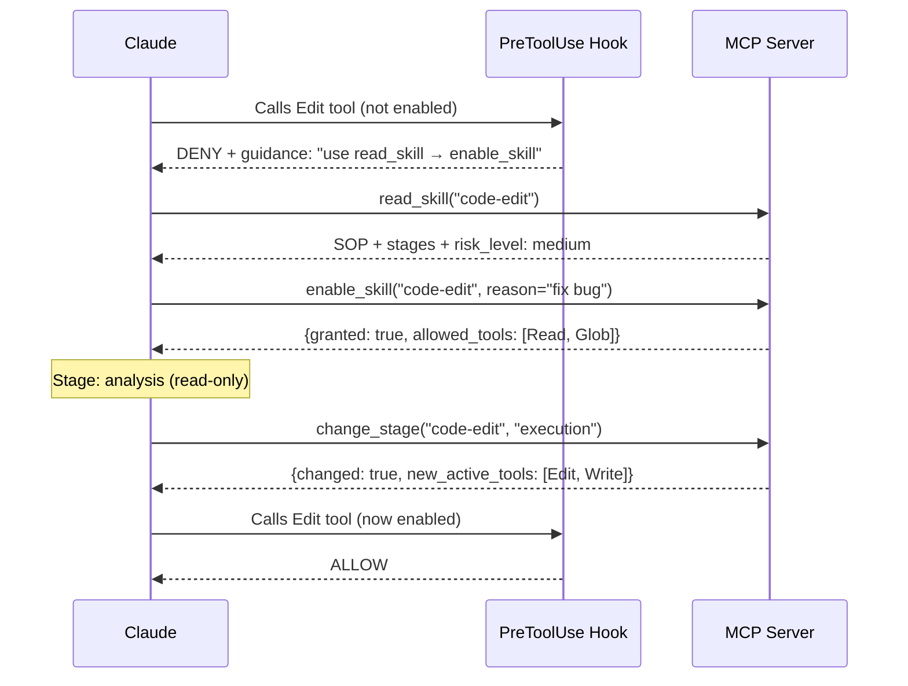
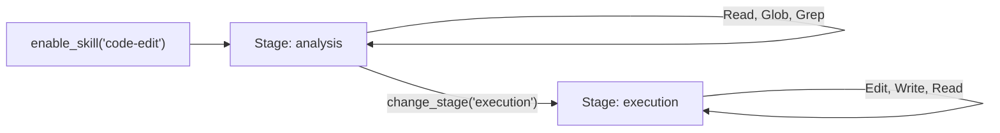
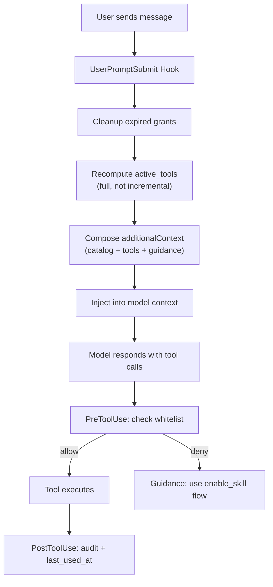

<div align="center">

# Tool-Gate

**Runtime governance for Claude Code tools and Skills**

Control what Claude can see, enable, and use — with **progressive disclosure**, **explicit grants**, **stage-aware tool access**, and **auditable guardrails**.

[中文 README](README_CN.md)

<p>
  
  
  
  
  
</p>

</div>

---

## Overview

Tool-Gate is a **Claude Code plugin** that adds a governance runtime between Claude and the tools it can call.

Instead of exposing every tool all the time, Tool-Gate follows a safer workflow:

**discover → read → enable → switch stage → execute**

That means Claude first sees a skill catalog, then reads the SOP, then explicitly enables a skill, and only then gets access to the smallest tool set needed for the current stage.

---

## Why Tool-Gate?

As the Claude Code plugin ecosystem grows, the model may face:

- **Too many tools at once** → context bloat and worse tool choices
- **Loose permission boundaries** → tools visible before they are truly needed
- **Mixed-up knowledge and execution** → the model can try to act before it fully understands the workflow
- **Weak runtime control** → hard to explain why a tool call was allowed or denied

Tool-Gate adds a **governance runtime** between Claude and its tools.

---

## Features

| Feature | What it means | Why it matters |
|---|---|---|
| **Progressive Disclosure** | Claude sees a skill catalog first, not the full tool universe | Reduces context bloat and premature tool use |
| **Explicit Grants** | A skill must be enabled before its tools become available | Keeps permission boundaries clear |
| **Stage-Based Access** | The same skill can expose different tools in different stages | Supports “understand first, modify later” workflows |
| **Per-Turn Recompute** | `active_tools` is recomputed on every user turn | Prevents stale state and leaked permissions |
| **Hard Runtime Guardrails** | `PreToolUse` blocks calls outside the whitelist | Enforces real boundaries, not just hints |
| **Auditability** | Skill read, enable, revoke, stage changes, and tool calls are logged | Makes decisions explainable and reviewable |
| **SQLite WAL Persistence** | Hooks and MCP server share state through local SQLite | Reliable local coordination without extra infrastructure |
| **Plugin-Native Design** | Built around Claude Code plugin conventions | Easy local testing and future distribution |

---

## Architecture Summary

### Dual-plane model

Tool-Gate separates two things that are often mixed together:

- **Knowledge plane** — what Claude is allowed to understand
- **Execution plane** — what Claude is allowed to do right now

This keeps the system safer and easier to reason about.

### Three runtime layers

| Layer | Main responsibility | Key parts |
|---|---|---|
| **Host** | Runs Claude and existing tools | Claude Model, built-in tools, other MCP servers |
| **Plugin adapter** | Connects the plugin to Claude Code | MCP server, hooks, Skills |
| **Governance core** | Decides what is visible, enabled, and allowed | Indexer, policy, grants, tool rewrite, prompt composer, storage |

### Core governance chain

```text
index → policy → grant → rewrite → gate
```

This is the control path that turns skill metadata and runtime state into real tool boundaries.

---

## Architecture at a Glance



**Simple summary:**
- The **adapter layer** talks to Claude Code
- The **core layer** enforces governance rules
- **SQLite WAL** keeps hook processes and MCP server state consistent

---

## Quick Start

### 1) Install

```bash
pip install -e ".[dev]"
```

### 2) Load the plugin locally

```bash
claude --plugin-dir /path/to/tool-gate
```

### 3) Validate the plugin

```bash
claude plugin validate /path/to/tool-gate
```

### 4) Run tests

```bash
pytest tests/ -v
```

---

## Example Flow

```text
Claude sees skill catalog
→ Claude reads a skill SOP
→ Claude enables the skill
→ Tool-Gate recomputes active_tools
→ Claude uses only the allowed tools
→ grant expires or is revoked
```

For staged skills:

```text
enable_skill("code-edit")
→ analysis stage: Read / Glob / Grep
→ change_stage("code-edit", "execution")
→ execution stage: Read / Edit / Write
```

---

## Current Status

| Area | Status |
|---|---|
| **Phase 1–3 core chain** | In place |
| **Phase 4 observability + quality** | In place — 9 audit event types, funnel metrics, 3-bucket miscall classification, optional Langfuse, E2E + boundary suites |
| **Core path** | `index → policy → grant → rewrite → gate` |
| **Tests** | 190+ passing, core module coverage ≥ 92% |
| **Code quality** | `ruff` clean, `mypy --strict` clean on `src/tool_governance/` |
| **Benchmarks** | Hook p95 < 1 ms, MCP p95 < 1 ms, skill-index cache hit rate 99.5% (see `docs/perf_results.md`) |

---

## Roadmap

### Layer 1 — Done
- Project scaffold
- Core governance models
- Policy and grant lifecycle
- Prompt and tool rewrite flow
- MCP server and hook orchestration

### Layer 2 — Done
- Hardening fixes and consistency cleanup (Phase 13: D1–D8 closed)
- Better audit completeness (9 canonical event types, `grant.revoke` as a distinct event)
- Drift cleanup and doc sync

### Layer 3 — Done
- End-to-end observability (`audit_log` funnel queries via `SQLiteStore.funnel_counts`)
- Funnel metrics and richer error bucketing (`whitelist_violation` / `wrong_skill_tool` / `parameter_error`)
- Optional Langfuse integration with graceful no-op fallback
- Release polish: ruff + mypy + coverage + micro-benchmarks

### Layer 4 — Next
- Approval workflow UX and mid-turn grant refresh
- Replay / evaluation harness
- Live-host E2E (real Claude Code CLI)

---

## FAQ

### Is this just a permission panel or a tool filter?
No. Tool-Gate is a **runtime governance layer**, not a static settings page. It controls discovery, enablement, stage transitions, tool visibility, and runtime interception.

### Why separate `read_skill` and `enable_skill`?
Because understanding and execution are different. Claude should first read the SOP and only then gain access to tools.

### Why not dynamically replace Claude’s tool list directly?
Claude Code does not reliably support direct per-turn tool override in the same way some agent runtimes do. Tool-Gate uses a practical combination of **soft guidance** (`UserPromptSubmit`) and **hard interception** (`PreToolUse`).

### Why use SQLite instead of Redis or another service?
Tool-Gate runs as a local plugin. SQLite WAL is enough to keep hook processes and the MCP server consistent without adding external infrastructure.

### Does it support staged editing workflows?
Yes. A skill can expose different allowed tools in different stages, such as `analysis` and `execution`.

### Is Tool-Gate finished?
Not fully. Phase 1–3 core governance is in place. The next step is hardening, observability, and Phase 4 polish.

---

## Contributing

Contributions are welcome, especially in these areas:

- hardening and consistency fixes
- test coverage improvements
- audit and observability enhancements
- documentation clarity and examples
- plugin UX and local developer workflow

A simple contribution flow:

1. Fork the repository
2. Create a feature branch
3. Run tests and validation locally
4. Submit a pull request with a clear summary of what changed and why

Before opening a PR, please run:

```bash
pytest tests/ -v
ruff check .
mypy src/tool_governance/
claude plugin validate /path/to/tool-gate
```

---

## Documentation

- `README.md` — English overview
- `README_CN.md` — Chinese overview
- `docs/` — design notes, requirements, and development plan

---

## Detailed Reference

The sections below keep the lower-level implementation details, runtime flows, configuration examples, and structure notes from the original README.

### How It Works — The 8-Step Core Chain



### Authorization Flow — Deny & Recovery



### Stage Switching

Skills can define **stages** — each stage exposes a different tool set. This enforces a "understand before modify" workflow:



### Per-Turn Rewrite Cycle

Every user message triggers the `UserPromptSubmit` hook — the core control point:



### SKILL.md Format

Each skill is a directory under `skills/` containing a `SKILL.md` file:

```yaml
---
name: Code Edit
description: "Code editing with staged access."
risk_level: medium          # low | medium | high
version: "1.0.0"
default_ttl: 3600
allowed_ops:
  - analyze
  - edit
stages:                     # Optional: stage-based tool sets
  - stage_id: analysis
    description: "Read-only analysis phase"
    allowed_tools: [Read, Glob, Grep]
  - stage_id: execution
    description: "Write phase"
    allowed_tools: [Read, Edit, Write]
---

# Code Edit

Workflow description and rules here (Markdown body = SOP).
```

| Field | Required | Description |
|-------|----------|-------------|
| `name` | Yes | Display name |
| `description` | Yes | Short description (truncated at 500 chars) |
| `risk_level` | No | `low` (auto-grant), `medium` (needs reason), `high` (needs approval) |
| `allowed_tools` | No | Tool whitelist (used when no stages defined) |
| `stages` | No | Stage definitions, each with its own `allowed_tools` |
| `allowed_ops` | No | Operations available via `run_skill_action` |

### Policy Configuration

Edit `config/default_policy.yaml` to customize governance rules:

```yaml
default_risk_thresholds:
  low: auto        # Auto-grant, no reason required
  medium: reason   # Model must provide a reason
  high: approval   # Requires user confirmation

default_ttl: 3600      # Grant duration in seconds
default_scope: session  # "session" or "turn"

skill_policies:         # Per-skill overrides
  dangerous-tool:
    auto_grant: false
    approval_required: true
    max_ttl: 300

blocked_tools: []       # Globally blocked tool names
```

**Evaluation chain**: blocked list → skill-specific policy → risk-level defaults.

### Project Structure

```text
tool-governance-plugin/
├── .claude-plugin/
│   └── plugin.json              # Plugin manifest
├── skills/
│   ├── governance/SKILL.md      # Self-governance skill (8 meta-tools)
│   ├── repo-read/SKILL.md       # Example: read-only (low risk)
│   ├── code-edit/SKILL.md       # Example: staged editing (medium risk)
│   └── web-search/SKILL.md      # Example: web research (low risk)
├── hooks/
│   └── hooks.json               # 4 hook bindings
├── .mcp.json                    # MCP server declaration
├── config/
│   └── default_policy.yaml      # Governance policy
├── src/tool_governance/
│   ├── mcp_server.py            # FastMCP server (8 meta-tools)
│   ├── hook_handler.py          # Hook event dispatcher
│   ├── bootstrap.py             # GovernanceRuntime factory
│   ├── core/
│   │   ├── skill_indexer.py     # Scan & parse SKILL.md files
│   │   ├── state_manager.py     # Session state lifecycle
│   │   ├── policy_engine.py     # Authorization evaluation
│   │   ├── grant_manager.py     # Grant create/revoke/expire
│   │   ├── tool_rewriter.py     # active_tools computation
│   │   ├── prompt_composer.py   # additionalContext generation
│   │   └── skill_executor.py    # run_skill_action dispatch
│   ├── models/                  # Pydantic v2 data models
│   ├── storage/
│   │   └── sqlite_store.py      # SQLite WAL persistence
│   └── utils/
│       └── cache.py             # Versioned TTL cache
├── tests/                       # 104 tests (pytest)
└── pyproject.toml               # Python 3.10+, src layout
```

### Implementation Principles

#### 1. Dual-Plane Architecture

The **knowledge plane** (`read_skill` → SOP) and **execution plane** (`enable_skill` → tools) are separated. The model must "understand" a skill before it can "use" it. This prevents blind tool invocation.

#### 2. Full Recompute, Not Incremental Append

`active_tools` is recalculated from scratch every turn:

```text
active_tools = meta_tools ∪ ⋃{stage_tools(skill) | skill ∈ skills_loaded} − blocked_tools
```

This eliminates stale state — if a grant expires, its tools vanish on the next turn.

#### 3. Soft Guidance + Hard Interception

Claude Code doesn't support `request.override(tools=...)`, so we use a two-layer strategy:
- **UserPromptSubmit** injects `additionalContext` telling the model which tools are available (soft guidance)
- **PreToolUse** denies any tool not in `active_tools` (hard interception)

#### 4. Cross-Process State via SQLite WAL

The Hook handler (short-lived process per event) and MCP server (long-lived stdio process) share state through SQLite in WAL mode. This gives concurrent reads + single writer with no external dependencies.

#### 5. Platform-Independent Entry Points

Instead of `python3 script.py` (breaks on Windows), we use `pyproject.toml` console scripts (`tg-hook`, `tg-mcp`). The Python launcher handles platform differences automatically.

### 8 Meta-Tools

| Tool | Input | Returns |
|------|-------|---------|
| `list_skills` | — | All skills with metadata and enabled status |
| `read_skill` | `skill_id` | Full SOP, allowed_tools, risk level |
| `enable_skill` | `skill_id, reason?, scope?, ttl?` | Grant result + new allowed tools |
| `disable_skill` | `skill_id` | Revocation confirmation |
| `grant_status` | — | All active grants for the session |
| `run_skill_action` | `skill_id, op, args?` | Operation result from skill handler |
| `change_stage` | `skill_id, stage_id` | Updated active_tools for new stage |
| `refresh_skills` | — | Re-scanned skill count |

### Testing

```bash
# All tests
pytest tests/ -v

# Type checking
mypy src/tool_governance/

# Linting
ruff check .

# Plugin validation
claude plugin validate /path/to/plugin
```

---

## License

MIT
