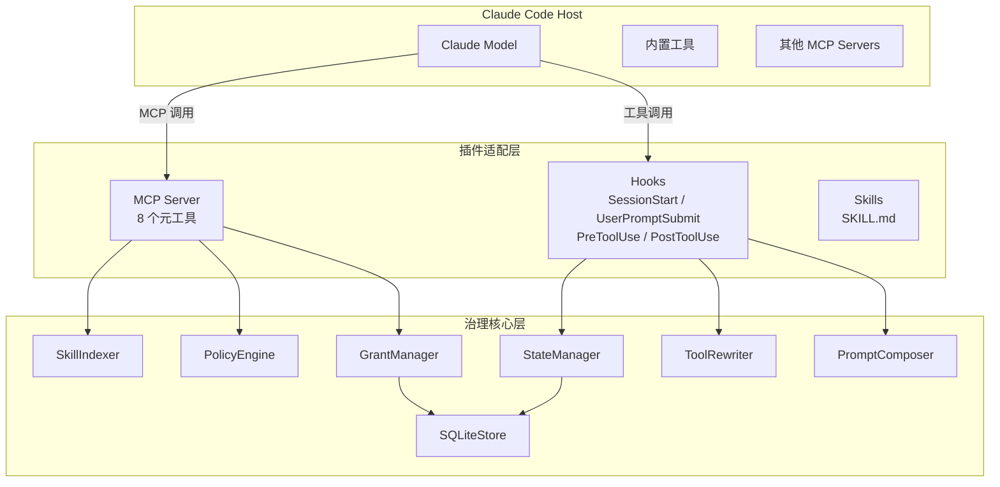
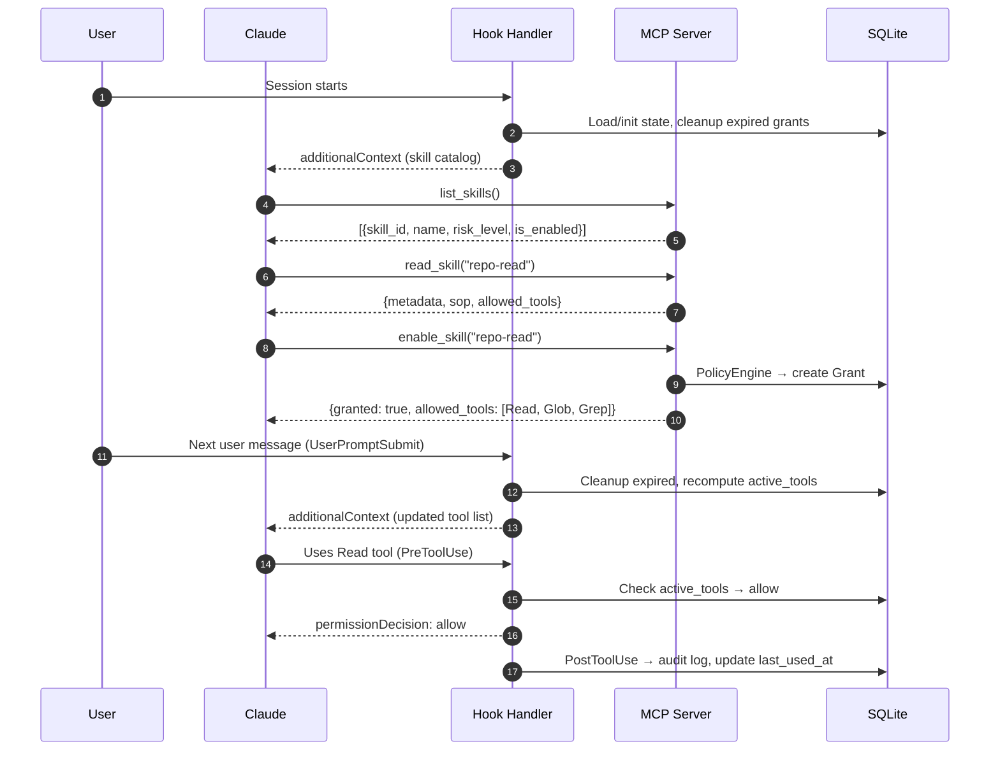
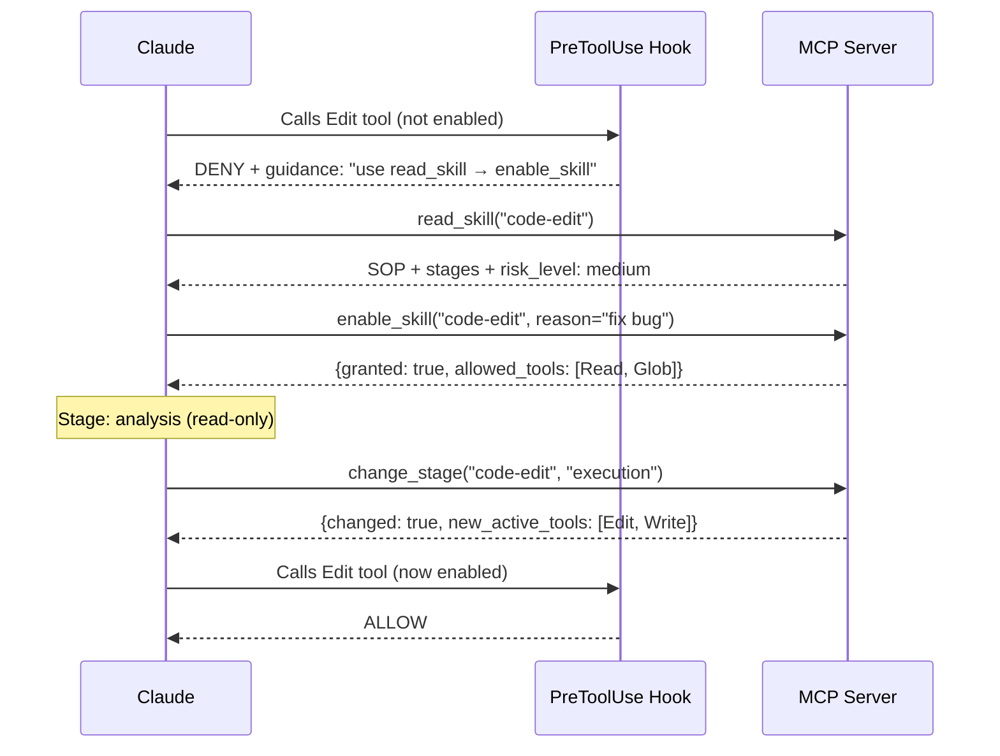
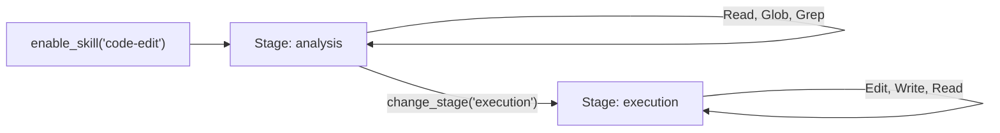
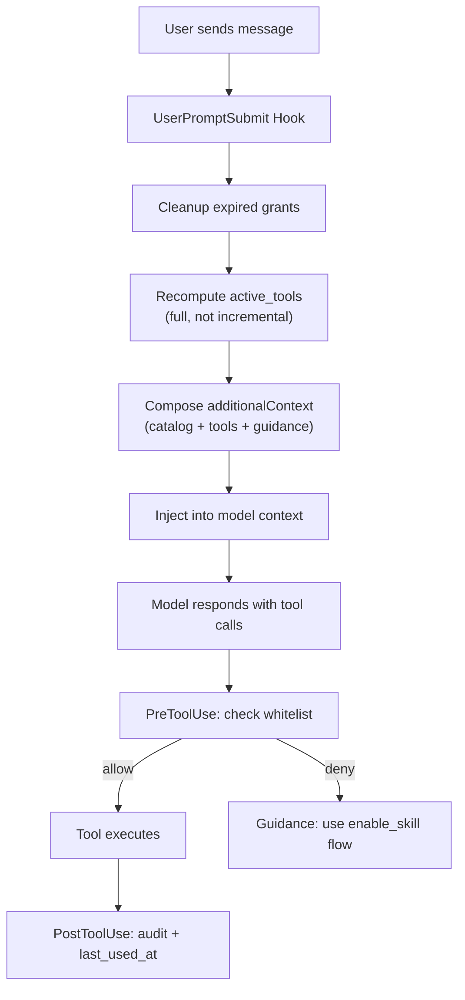

<div align="center">

# Tool-Gate

**面向 Claude Code 的工具与 Skills 运行时治理插件**

让 Claude 只在**合适的时机**看到、启用并使用**合适的工具**。

[English README](README.md)

<p>
  
  
  
  
  
</p>

</div>

---

## 项目概览

Tool-Gate 是一个 **Claude Code 插件形态的运行时治理层**。

它不是把所有工具一股脑都暴露给 Claude，而是采用一条更可控的流程：

**发现技能 → 阅读说明 → 显式启用 → 阶段切换 → 使用工具**

也就是说，Claude 先看到技能目录，再读 SOP，再启用技能，最后才拿到当前阶段真正需要的最小工具集。

---

## 为什么需要 Tool-Gate？

随着 Claude Code 插件和工具越来越多，模型很容易遇到几个实际问题：

- **工具太多**：上下文膨胀，选错工具的概率上升
- **权限边界不清**：工具在不该暴露的时候就提前暴露
- **理解和执行混在一起**：模型还没读懂流程就开始动手
- **运行时缺少治理**：很难解释某次调用为什么被放行或被拦截

Tool-Gate 的作用，就是在 Claude 和工具之间加上一层**运行时治理层**。

---

## Features

| 能力 | 具体含义 | 价值 |
|---|---|---|
| **渐进式披露** | Claude 先看到技能目录，而不是完整工具宇宙 | 降低上下文噪音和误调用 |
| **显式授权** | 只有启用技能后，对应工具才会进入当前可用范围 | 权限边界更清晰 |
| **Stage 分阶段暴露** | 同一个技能可以在不同阶段暴露不同工具 | 支持“先理解、后修改”的工作流 |
| **每轮全量重算** | `active_tools` 在每一轮用户消息后重新计算 | 避免陈旧状态和权限泄漏 |
| **运行时硬拦截** | `PreToolUse` 对白名单外工具直接拦截 | 不是光靠提示，而是真正有边界 |
| **审计可追踪** | 读取技能、启用技能、切换阶段、工具调用都会记录 | 方便复查、分析和解释 |
| **SQLite WAL 持久化** | Hook 与 MCP Server 通过本地 SQLite 共享状态 | 无需额外基础设施也能稳定协同 |
| **原生插件形态** | 设计上对齐 Claude Code 插件方式 | 便于本地调试和后续分发 |

---

## Architecture 小结

### 双平面模型

Tool-Gate 把容易混在一起的两件事拆开了：

- **知识平面**：Claude 现在能理解什么
- **执行平面**：Claude 现在能做什么

这样系统会更安全，也更容易解释。

### 三层运行时结构

| 层级 | 主要职责 | 关键部分 |
|---|---|---|
| **宿主层** | 承载 Claude 和现有工具 | Claude Model、内置工具、其他 MCP |
| **插件适配层** | 负责和 Claude Code 对接 | MCP Server、Hooks、Skills |
| **治理核心层** | 真正决定当前允许什么 | Indexer、Policy、Grant、Tool Rewrite、Prompt Composer、Storage |

### 核心治理链

```text
index → policy → grant → rewrite → gate
```

这条链路会把技能元数据和运行时状态，真正转成“现在允许哪些工具”。

---

## 架构总览



可以把它简单理解为：
- **插件适配层**负责和 Claude Code 对接
- **治理核心层**负责计算“现在到底允许什么”
- **SQLite WAL** 负责在 Hook 进程和 MCP Server 之间共享状态

---

## 快速开始

### 1）安装依赖

```bash
pip install -e ".[dev]"
```

### 2）本地加载插件

```bash
claude --plugin-dir /path/to/tool-gate
```

### 3）校验插件结构

```bash
claude plugin validate /path/to/tool-gate
```

### 4）运行测试

```bash
pytest tests/ -v
```

---

## 示例流程

```text
Claude 看到技能目录
→ Claude 阅读技能说明
→ Claude 启用技能
→ Tool-Gate 重算 active_tools
→ Claude 只使用当前允许的工具
→ grant 过期或被撤销
```

对于带阶段的技能：

```text
enable_skill("code-edit")
→ analysis 阶段：Read / Glob / Grep
→ change_stage("code-edit", "execution")
→ execution 阶段：Read / Edit / Write
```

---

## 当前状态

| 模块 | 状态 |
|---|---|
| **Phase 1–3 核心链路** | 已打通 |
| **核心治理链** | `index → policy → grant → rewrite → gate` |
| **测试** | 104+ 通过 |
| **当前重点** | 收口修复、一致性清理、文档同步，之后再进入完整 Phase 4 |

---

## Roadmap

### 第一层：已完成
- 项目脚手架
- 核心治理数据模型
- 策略与授权生命周期
- Prompt / 工具重写链路
- MCP Server 与 Hook 编排

### 第二层：进行中
- 收口修复与一致性清理
- 审计完整性增强
- drift 清理与文档同步

### 第三层：下一步
- 端到端观测能力
- 漏斗指标与更细的错误分桶
- Langfuse 集成
- 发布打磨与 Phase 4 完成

---

## FAQ

### 它只是一个权限面板或者工具过滤器吗？
不是。Tool-Gate 是一个**运行时治理层**，不是静态配置页。它管理的是技能发现、显式授权、阶段切换、工具暴露和运行时拦截的完整链路。

### 为什么要把 `read_skill` 和 `enable_skill` 分开？
因为“理解能力”和“执行权限”不是一回事。Claude 应该先读 SOP，再获得执行权限。

### 为什么不直接每轮替换 Claude 能看到的工具列表？
Claude Code 目前并不适合像某些 Agent 运行时那样，直接做稳定的每轮工具覆盖。Tool-Gate 采用的是更务实的组合：
- **UserPromptSubmit** 做软引导
- **PreToolUse** 做硬拦截

### 为什么用 SQLite，而不是 Redis 之类？
因为 Tool-Gate 是本地插件。SQLite WAL 足够让 Hook 进程和 MCP Server 稳定共享状态，而且不需要额外基础设施。

### 支持分阶段编辑吗？
支持。一个技能可以在不同阶段暴露不同工具，比如 `analysis` 和 `execution`。

### 项目现在已经完成了吗？
还没有完全完成。Phase 1–3 核心治理已经到位，接下来重点是收口修复、观测能力和 Phase 4 打磨。

---

## Contributing

欢迎贡献，尤其是这些方向：

- 收口修复与一致性清理
- 测试覆盖增强
- 审计与观测能力增强
- 文档可读性和示例补充
- 插件本地开发体验优化

一个简单的贡献流程：

1. Fork 仓库
2. 新建分支
3. 本地跑测试和校验
4. 提交 PR，并说明改了什么、为什么改

提交前建议运行：

```bash
pytest tests/ -v
ruff check .
mypy src/tool_governance/
claude plugin validate /path/to/tool-gate
```

---

## 文档导航

- `README.md`：英文概览
- `README_CN.md`：中文概览
- `docs/`：需求、技术方案、开发计划等长文档

---

## 详细参考

下面这些部分保留了原 README 中更底层的实现细节、运行链路、配置示例和结构说明，方便继续开发和查阅。

### 核心 8 步链路



### 拒绝与恢复流程



### Stage 切换

技能可以定义多个 **stages**，每个阶段暴露不同工具，从而实现“先理解，再修改”的工作流：



### 每轮重写循环

每次用户消息都会触发 `UserPromptSubmit`，这是最核心的控制点：



### SKILL.md 格式

每个技能在 `skills/` 下对应一个目录，内部包含 `SKILL.md`：

```yaml
---
name: Code Edit
description: "Code editing with staged access."
risk_level: medium          # low | medium | high
version: "1.0.0"
default_ttl: 3600
allowed_ops:
  - analyze
  - edit
stages:
  - stage_id: analysis
    description: "Read-only analysis phase"
    allowed_tools: [Read, Glob, Grep]
  - stage_id: execution
    description: "Write phase"
    allowed_tools: [Read, Edit, Write]
---

# Code Edit

Workflow description and rules here (Markdown body = SOP).
```

| 字段 | 是否必填 | 说明 |
|-------|----------|-------------|
| `name` | 是 | 显示名称 |
| `description` | 是 | 简短描述（最长 500 字符） |
| `risk_level` | 否 | `low` / `medium` / `high` |
| `allowed_tools` | 否 | 不定义 stages 时使用的工具白名单 |
| `stages` | 否 | 分阶段定义，每个阶段有自己的 `allowed_tools` |
| `allowed_ops` | 否 | `run_skill_action` 可用的操作 |

### 策略配置

可以通过 `config/default_policy.yaml` 自定义治理规则：

```yaml
default_risk_thresholds:
  low: auto        # 自动授权
  medium: reason   # 需要理由
  high: approval   # 需要人工确认

default_ttl: 3600
default_scope: session

skill_policies:
  dangerous-tool:
    auto_grant: false
    approval_required: true
    max_ttl: 300

blocked_tools: []
```

**评估顺序**：全局 blocked → skill-specific policy → risk-level defaults。

### 项目结构

```text
tool-governance-plugin/
├── .claude-plugin/
│   └── plugin.json              # 插件清单
├── skills/
│   ├── governance/SKILL.md      # 自治理技能（8 个元工具）
│   ├── repo-read/SKILL.md       # 示例：只读技能
│   ├── code-edit/SKILL.md       # 示例：分阶段编辑技能
│   └── web-search/SKILL.md      # 示例：搜索技能
├── hooks/
│   └── hooks.json               # 4 类 hook 绑定
├── .mcp.json                    # MCP 声明
├── config/
│   └── default_policy.yaml      # 治理策略
├── src/tool_governance/
│   ├── mcp_server.py            # FastMCP server（8 个元工具）
│   ├── hook_handler.py          # Hook 事件分发
│   ├── bootstrap.py             # GovernanceRuntime 工厂
│   ├── core/
│   │   ├── skill_indexer.py     # 扫描并解析 SKILL.md
│   │   ├── state_manager.py     # 会话状态生命周期
│   │   ├── policy_engine.py     # 授权评估
│   │   ├── grant_manager.py     # grant 创建/撤销/过期
│   │   ├── tool_rewriter.py     # active_tools 计算
│   │   ├── prompt_composer.py   # additionalContext 生成
│   │   └── skill_executor.py    # run_skill_action 分发
│   ├── models/                  # Pydantic v2 数据模型
│   ├── storage/
│   │   └── sqlite_store.py      # SQLite WAL 持久化
│   └── utils/
│       └── cache.py             # Versioned TTL cache
├── tests/                       # 104 tests (pytest)
└── pyproject.toml               # Python 3.10+, src layout
```

### 实现原则

#### 1. 双平面架构

**知识平面**（`read_skill` → SOP）和**执行平面**（`enable_skill` → tools）分离。模型必须先“理解”技能，才能“使用”技能。

#### 2. 全量重算，而不是不断追加

`active_tools` 每轮从头计算：

```text
active_tools = meta_tools ∪ ⋃{stage_tools(skill) | skill ∈ skills_loaded} − blocked_tools
```

这样如果 grant 过期，对应工具会在下一轮自然消失。

#### 3. 软引导 + 硬拦截

Claude Code 不支持 `request.override(tools=...)`，所以采用双层策略：
- **UserPromptSubmit** 用 `additionalContext` 做软引导
- **PreToolUse** 对白名单外工具做硬拦截

#### 4. SQLite WAL 跨进程共享状态

Hook handler 是短生命周期进程，MCP server 是长生命周期 stdio 进程。两者通过 SQLite WAL 共享状态，不需要外部依赖。

#### 5. 平台无关的入口方式

不直接使用 `python3 script.py`，而通过 `pyproject.toml` console scripts（例如 `tg-hook`、`tg-mcp`）统一入口，避免平台差异。

### 8 个元工具

| Tool | 输入 | 返回 |
|------|-------|---------|
| `list_skills` | — | 所有技能及其元信息、启用状态 |
| `read_skill` | `skill_id` | 完整 SOP、allowed_tools、risk level |
| `enable_skill` | `skill_id, reason?, scope?, ttl?` | 授权结果 + 新工具集 |
| `disable_skill` | `skill_id` | 撤销确认 |
| `grant_status` | — | 当前会话所有活跃 grant |
| `run_skill_action` | `skill_id, op, args?` | 技能处理器返回结果 |
| `change_stage` | `skill_id, stage_id` | 切换阶段后的 active_tools |
| `refresh_skills` | — | 重新扫描后的技能数量 |

### 测试

```bash
# 全量测试
pytest tests/ -v

# 类型检查
mypy src/tool_governance/

# Lint
ruff check .

# 插件校验
claude plugin validate /path/to/plugin
```

---

## License

MIT
